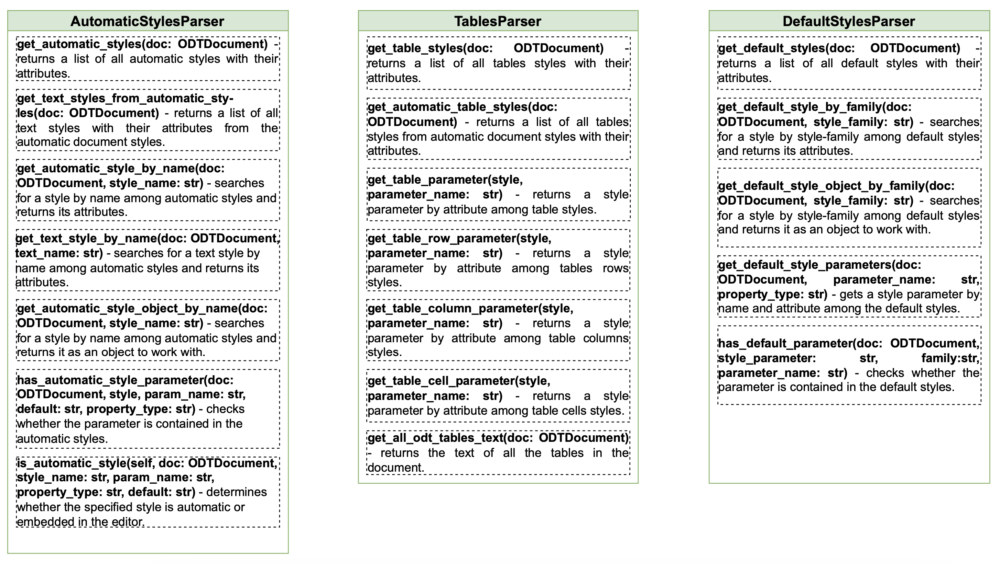
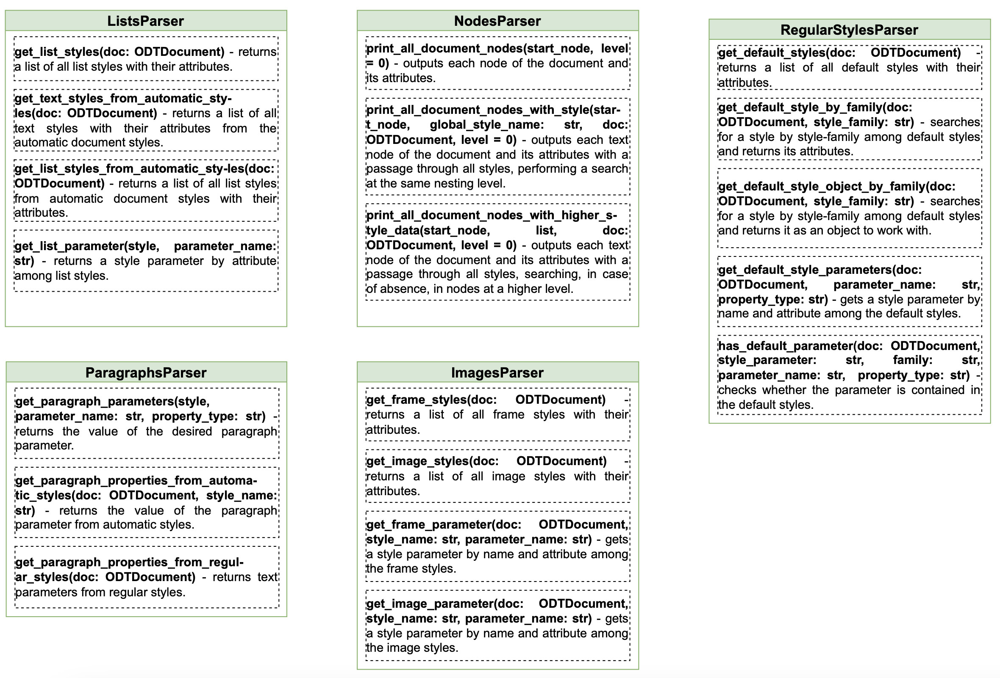

# Классы парсинга структурных элементов
*Схема директории представлена на рисунках ниже:*

---
## Описание классов:
1. **AutomaticStylesParser** - класс, содержащий методы для работы с автоматическими стилями в документе формата ODT.
   - _get_automatic_styles(doc: ODTDocument)_ - возвращает список всех автоматических стилей документа с их атрибутами.
   - _get_text_styles_from_automatic_styles(doc: ODTDocument)_ - возвращает список всех стилей текста с их атрибутами из автоматических стилей документа.
   - _get_automatic_style_by_name(doc: ODTDocument, style_name: str)_ - выполняет поиск стиля по имени среди автоматических стилей и возвращает его атрибуты.
   - _get_text_style_by_name(doc: ODTDocument, text_name: str)_ - выполняет поиск текстового стиля по имени среди автоматических стилей и возвращает его атрибуты.
   - _get_automatic_style_object_by_name(doc: ODTDocument, style_name: str)_ - выполняет поиск стиля по имени среди автоматических стилей и возвращает его как объект для работы.
   - _has_automatic_style_parameter(doc: ODTDocument, style, param_name: str, default: str, property_type: str)_ - проверяет содержится ли параметр в автоматических стилях.
   - _is_automatic_style(self, doc: ODTDocument, style_name: str, param_name: str, property_type: str, default: str)_ - определяет является ли указанный стиль автоматическим или встроенным в редактор.
2. **DefaultStylesParser** - класс, содержащий методы для работы со стилями по умолчанию в документе формата ODT.
   - _get_default_styles(doc: ODTDocument)_ - возвращает список всех стилей по умолчанию документа с их атрибутами.
   - _get_default_style_by_name(doc: ODTDocument, style_family: str)_ - выполняет поиск стиля по семейству стилей среди стилей по умолчанию и возвращает его атрибуты.
   - _get_default_style_object_by_family(doc: ODTDocument, style_family: str)_ - выполняет поиск стиля по семейству стилей среди стилей по умолчанию и возвращает его как объект для работы.
   - _get_default_style_parameters(style, parameter_name: str, property_type: str)_ - получает параметр стиля по имени и атрибуту среди стилей по умолчанию.
   - _has_default_parameter(self, doc: ODTDocument, style_parameter: str, family: str, parameter_name: str, property_type: str)_ - проверяет содержится ли параметр в стилях по умолчанию.
3. **RegularStylesParser** - класс, содержащий методы для работы с обычными стилями в документе формата ODT.
   - _get_regular_styles(doc: ODTDocument)_ - возвращает список всех обычных стилей документа с их атрибутами.
   - _get_text_styles_from_regular_styles(doc: ODTDocument)_ - возвращает список всех стилей текста с их атрибутами из обычных стилей документа.
   - _get_regular_style(doc: ODTDocument, style_name: str)_ - возвращает список атрибутов заданного обычного стиля.
   - _get_regular_style_object(doc: ODTDocument, style_name: str)_ - выполняет поиск стиля по семейству стилей среди стилей по умолчанию и возвращает его как объект для работы.
   - _get_parameter_from_regular_style_fast(doc: ODTDocument, default: str, style_name: str, param_name: str, property_type: str)_ - проверяет наличие указанного стиля в стилях редактора без рекурсии.
   - _get_parameter_from_regular_style(doc: ODTDocument, default: str, style_name: str, param_name: str, property_type: str)_ - проверяет наличие указанного стиля в стилях редактора с использованием рекурсии.
   - _get_paragraph_alignment(doc: ODTDocument, style_name: str)_ - возвращает значение выравнивания параметра абзаца.
4. **ImagesParser** - класс, содержащий методы для работы со стилями изображений и рамок в документе формата ODT.
   - _get_frame_styles(doc: ODTDocument)_ - возвращает список всех стилей рамок документа с их атрибутами.
   - _get_image_styles(doc: ODTDocument)_ - возвращает список всех стилей изображений документа с их атрибутами.
   - _get_frame_parameter(doc: ODTDocument, style_name: str, parameter_name: str)_ - получает параметр стиля по имени и атрибуту среди стилей рамок.
   - _get_image_parameter(doc: ODTDocument, style_name: str, parameter_name: str)_ - получает параметр стиля по имени и атрибуту среди стилей изображений.
5. **ListsParser** - класс, содержащий методы для работы со стилями списков в документе формата ODT.
   - _get_list_styles(doc: ODTDocument)_ - возвращает список всех стилей списков документа с их атрибутами.
   - _get_lists_text_styles(doc: ODTDocument)_ - возвращает список всех текстовых стилей с их атрибутами из списка стилей документа.
   - _get_list_styles_from_automatic_styles(doc: ODTDocument)_ - возвращает список всех стилей списков из автоматических стилей документа с их атрибутами.
   - _get_list_parameter(style, parameter_name: str)_ - возвращает параметр стиля по атрибуту среди стилей списков.
6. **NodesParser** - класс, содержащий методы для обхода узлов стилей документа.
   - _print_all_document_nodes(start_node, level=0)_ - выводит каждый узел документа и его атрибуты.
   - _print_all_document_nodes_with_style(start_node, global_style_name, doc: ODTDocument, level=0)_ - выводит каждый каждый текстовый узел документа и его атрибуты с прохождением по всем стилям, выполняя поиск на одном уровне вложенности.
   - _print_all_document_nodes_with_higher_style_data((start_node, attributes_list, doc: ODTDocument, level=0)_ - выводит каждый каждый текстовый узел документа и его атрибуты с прохождением по всем стилям, выполняя поиск, в случае отсутствия, в узлах уровнем выше.
7. **ParagraphsParser** - класс, содержащий методы для работы со стилями абзацев в документе формата ODT.
   - _get_paragraph_parameters(style, parameter_name: str, property_type: str)_ - возвращает значение искомого параметра абзаца.
   - _get_paragraph_properties_from_automatic_styles(doc: ODTDocument, style_name: str)_ - возвращает значение параметра абзаца из автоматических стилей.
   - _get_paragraph_styles_from_regular_styles(doc: ODTDocument)_ - возвращает параметры текста из обычных стилей.
8. **TablesParser** - класс, содержащий методы для работы со стилями таблиц в документе формата ODT.
   - _get_table_styles(doc: ODTDocument)_ - возвращает список всех стилей таблиц документа с их атрибутами.
   - _get_automatic_table_styles(doc: ODTDocument)_ - возвращает список всех стилей таблиц из автоматических стилей документа с их атрибутами.
   - _get_table_parameter(style, parameter_name: str)_ - возвращает параметр стиля по атрибуту среди стилей таблиц.
   - _get_table_row_parameter(style, parameter_name: str)_ - возвращает параметр стиля по атрибуту среди стилей строк таблиц.
   - _get_table_column_parameter(style, parameter_name: str)_ - возвращает параметр стиля по атрибуту среди стилей столбцов таблиц.
   - _get_table_cell_parameter(style, parameter_name: str)_ - возвращает параметр стиля по атрибуту среди стилей ячеек таблиц.
   - _get_all_odt_tables_text(doc: ODTDocument)_ - возвращает текст всех таблиц документа.